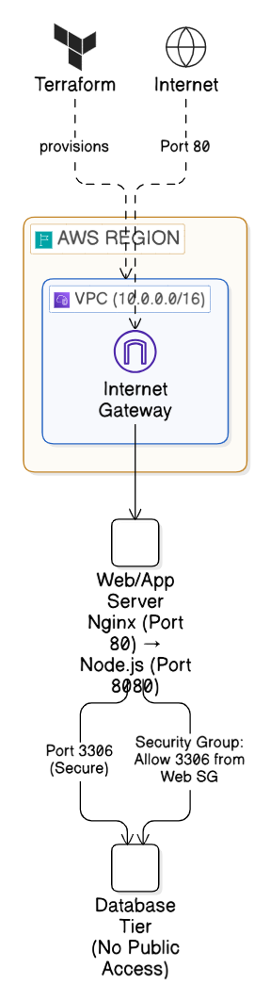

# EpicBook App — Production-Style AWS Infrastructure with Terraform

Production-oriented AWS infrastructure deployment for the EpicBook full-stack application using Terraform and Bash automation.

This project provisions a complete AWS cloud environment including networking, compute, database infrastructure, security groups, Nginx reverse proxy, and automated application deployment with minimal manual intervention.

The infrastructure is designed to simulate real-world DevOps deployment practices using Infrastructure as Code (IaC), secure networking principles, and automated provisioning workflows.

---



---

# Project Goal

The goal of this project was to simulate a production-style cloud deployment workflow while applying infrastructure automation and secure architecture principles.

This project focuses on:

- Infrastructure as Code (IaC)
- Reproducible deployments
- Secure database isolation
- Cloud networking fundamentals
- Automated provisioning
- Operational simplicity
- Production-style deployment structure

---

# What This Builds

## Network

- VPC (`10.0.0.0/16`)
- Public subnet (`10.0.1.0/24`) — EC2 application server
- Private subnet A (`10.0.2.0/24`) — RDS primary
- Private subnet B (`10.0.3.0/24`) — RDS subnet group requirement
- Internet Gateway
- Route table with IGW route associated to public subnet only

## Security

- EC2 security group — SSH (your IP only), HTTP (open)
- RDS security group — MySQL port 3306 accessible only from EC2 security group
- Security Group-to-Security Group communication instead of CIDR-based database access
- Egress rules configured for outbound communication

## Compute

- Ubuntu 22.04 LTS EC2 (`t2.micro`)
- SSH key pair provisioning
- Public IP assignment
- Automated bootstrap process through `userdata.sh`

## Database

- RDS MySQL 8.0 (`db.t3.micro`)
- Private subnet deployment with no public exposure
- DB subnet group spanning two availability zones
- Sequelize auto-generates tables during initial deployment

## Application

- Node.js + Express backend
- PM2 process manager for persistent application runtime
- Nginx reverse proxy on port 80 → Node.js app on port 8080
- Automated SQL dump import during bootstrap process

---

# Architecture Flow

1. User sends request to the EC2 public IP
2. Nginx receives traffic on port 80
3. Nginx proxies requests to the Node.js application running on port 8080
4. Application communicates securely with RDS MySQL in private subnets
5. Security groups restrict database access to the application server only

---

# Prerequisites

- [Terraform](https://developer.hashicorp.com/terraform/install)
- [AWS CLI](https://aws.amazon.com/cli/)
- Active AWS account
- SSH key pair located at:
  - `~/.ssh/id_rsa`
  - `~/.ssh/id_rsa.pub`

---

# Project Structure

```bash
epicbook-app/
├── main.tf           # Provider and Terraform configuration
├── variables.tf      # Input variables
├── outputs.tf        # Terraform outputs
├── network.tf        # VPC, subnets, routing
├── security.tf       # Security groups and rules
├── compute.tf        # EC2 instance and SSH key
├── database.tf       # RDS and DB subnet group
├── userdata.sh       # Automated bootstrap and deployment
├── .gitignore
├── README.md
├── WALKTHROUGH.md
└── docs/
    └── architecture.png
```

For a full deployment walkthrough see:

```bash
WALKTHROUGH.md
```

---

# Tech Stack

## Cloud Platform
- AWS

## Infrastructure as Code
- Terraform

## Compute & Runtime
- EC2
- Ubuntu 22.04
- PM2
- Nginx

## Database
- RDS MySQL 8.0

## Backend
- Node.js
- Express.js

## Scripting & Automation
- Bash
- userdata.sh

---

# Infrastructure Features

- Fully automated provisioning using Terraform
- Infrastructure separation across multiple Terraform files
- Public and private subnet architecture
- Secure database isolation
- Automated application deployment
- Dynamic SSH restriction based on deployer public IP
- Reverse proxy setup using Nginx
- Persistent Node.js runtime with PM2
- Reproducible deployment workflow

---

# Setup

## 1. Clone Repository

```bash
git clone https://github.com/0dow0ri7s3/tf-aws-infrastructure.git
cd tf-aws-infrastructure/epicbook-app
```

---

## 2. Configure AWS CLI

```bash
aws configure
```

---

## 3. Initialize Terraform

```bash
terraform init
```

---

## 4. Plan Infrastructure

```bash
terraform plan -out=tfplan
```

---

## 5. Apply Infrastructure

```bash
terraform apply tfplan
```

---

# Deployment Timing

- EC2 provisioning: ~2–3 minutes
- RDS provisioning: ~10–15 minutes
- Bootstrap automation: ~5–10 minutes

Estimated total deployment time:
- ~20 minutes

---

# Terraform Outputs

After deployment completes:

```bash
ec2_public_ip = "x.x.x.x"
rds_endpoint  = "epicbook-rds.xxxxx.us-west-1.rds.amazonaws.com"
app_url       = "http://x.x.x.x"
```

---

# Access the Application

```bash
http://<ec2_public_ip>
```

---

# SSH Into the EC2 Instance

```bash
ssh -i ~/.ssh/id_rsa ubuntu@<ec2_public_ip>
```

---

# Verify Services

## Check PM2

```bash
pm2 status
```

---

## Verify Application Port

```bash
ss -tulpn | grep 8080
```

---

## Check Nginx Status

```bash
sudo systemctl status nginx
```

---

## Verify Database Connectivity

```bash
mysql -h <rds_endpoint> -u admin123 -p -e "USE bookstore; SELECT COUNT(*) FROM Book;"
```

---

# Dynamic SSH IP Restriction

Terraform dynamically fetches the deployer's public IP:

```hcl
data "http" "my_ip" {
  url = "https://api.ipify.org"
}
```

If your IP changes:

```bash
terraform plan -out=tfplan
terraform apply tfplan
```

---

# Security Considerations

- RDS deployed in private subnets with no public exposure
- Database access restricted using Security Group references
- SSH access limited to deployer's public IP
- Public internet access restricted to application layer only
- Infrastructure components separated through subnet segmentation
- Controlled communication between application and database layers

---

# Tear Down Infrastructure

```bash
terraform destroy
```

Note:
- RDS deletion may take 10–15 minutes
- AWS waits for RDS ENIs to fully detach before deleting the VPC
- This behavior is expected

---

# Key Lessons Learned

- Multi-file Terraform structure improves maintainability and separation of concerns
- RDS private subnet deployment is standard practice for database security
- Security Group-to-Security Group communication is safer than CIDR-based access
- `templatefile()` allows dynamic infrastructure values to be injected into userdata scripts
- PM2 must run under the correct Linux user to survive reboots properly
- The application database configuration required dynamic RDS credential injection
- RDS subnet groups require multi-AZ subnet definitions even in single-AZ deployments
- AWS infrastructure teardown can be delayed due to ENI dependency cleanup

---

# Challenges Faced

- Managing secure communication between infrastructure layers
- Configuring dynamic RDS connectivity during automated deployment
- Handling PM2 process persistence correctly
- Structuring Terraform files for readability and scalability
- Understanding AWS networking and subnet behavior
- Managing infrastructure teardown dependencies during destroy operations

---

# Future Improvements

- Add Application Load Balancer (ALB)
- Introduce Auto Scaling Group
- Containerize application using Docker
- Add CI/CD pipeline with GitHub Actions
- Store Terraform remote state in S3 with DynamoDB locking
- Add monitoring using Prometheus and Grafana
- Introduce centralized logging
- Deploy application using Kubernetes

---

# Author

**Odoworitse Afari**  
Cloud & DevOps Engineer

GitHub: https://github.com/0dow0ri7s3  
LinkedIn: https://linkedin.com/in/odoworitse-afari
