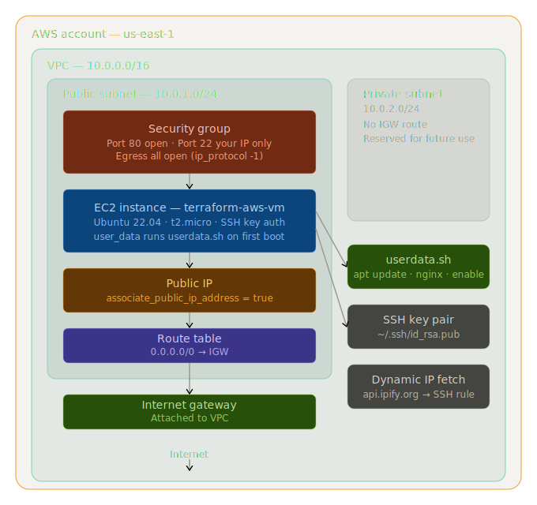

# linux-vm — AWS

Provisions a Linux virtual machine on AWS with a custom VPC, public and private subnets, security group, and a bootstrapped Nginx web server. Fully automated with Terraform.

---



---

## What This Builds

- Custom VPC (`10.0.0.0/16`)
- Public subnet (`10.0.1.0/24`) and private subnet (`10.0.2.0/24`)
- Internet Gateway attached to VPC
- Route table pointing all outbound traffic to the IGW
- Route table association to public subnet
- Security group — HTTP open to all, SSH restricted to your IP
- Egress rule — all outbound traffic allowed
- SSH key pair (from local `~/.ssh/id_rsa.pub`)
- Ubuntu 22.04 LTS EC2 instance (`t2.micro`) in the public subnet
- Nginx installed and started on first boot via `user_data`

---

## Prerequisites

- [Terraform](https://developer.hashicorp.com/terraform/install) installed
- [AWS CLI](https://docs.aws.amazon.com/cli/latest/userguide/install-cliv2.html) installed and configured
- An active AWS account
- SSH key pair at `~/.ssh/id_rsa` and `~/.ssh/id_rsa.pub`

Configure AWS CLI:
```bash
aws configure
```

---

## Project Structure

```
linux-vm/
├── main.tf            # All resources defined here
├── userdata.sh        # Bootstrap script (installs Nginx)
├── .gitignore         # Excludes state files and secrets
├── README.md          # Quick overview, what it builds, how to run it
├── WALKTHROUGH.md     # Full step-by-step guide with troubleshooting
└── docs/
    └── architecture.png
```

For a detailed step-by-step breakdown of every resource, command, and error fix — see [WALKTHROUGH.md](./WALKTHROUGH.md).

---

## Setup

**1. Clone the repo**
```bash
git clone https://github.com/0dow0ri7s3/tf-aws-infrastructure.git
cd tf-aws-infrastructure/linux-vm
```

**2. Generate SSH key (if you don't have one)**
```bash
ssh-keygen -t rsa -b 4096
```

**3. Initialize Terraform**
```bash
terraform init
```

**4. Plan and apply**
```bash
terraform plan -out=tfplan
terraform apply tfplan
```

After apply, the public IP prints to the terminal. Paste it in a browser — Nginx default page confirms the VM is running.

---

## SSH Into the VM

```bash
ssh -i ~/.ssh/id_rsa ubuntu@<public_ip>
```

Note: AWS Ubuntu instances use `ubuntu` as the default username.

---

## Dynamic IP on Security Group

The SSH rule auto-fetches your current public IP at plan time:

```hcl
data "http" "my_ip" {
  url = "https://api.ipify.org"
}
```

No manual IP updates needed. Just re-run `terraform plan -out=tfplan && terraform apply tfplan` after a restart and your IP updates automatically.

---

## userdata.sh

Runs once on first boot:

```bash
#!/bin/bash
apt-get update -y
apt-get install -y nginx
systemctl start nginx
systemctl enable nginx
```

---

## Tear Down

```bash
terraform destroy
```

Removes all provisioned resources from AWS.

---

## Key Lessons

- AWS requires an explicit egress rule — without it the VM has no outbound access and can't install packages
- `user_data` on AWS works the same as `custom_data` on Azure but the script must start with `#!/bin/bash` or cloud-init ignores it
- Dynamic IP fetching via `api.ipify.org` keeps SSH rules locked to your current IP without manual updates
- `associate_public_ip_address = true` must be set explicitly on the EC2 instance — it's not automatic
- Route table association is a separate resource — creating the route table alone is not enough
- Always use `terraform plan -out=tfplan` before applying to lock in exactly what gets deployed

---

## Author

**Odoworitse Ab. Afari**
Junior DevOps Engineer
[GitHub](https://github.com/0dow0ri7s3) · [LinkedIn](https://linkedin.com/in/odoworitse-afari)
