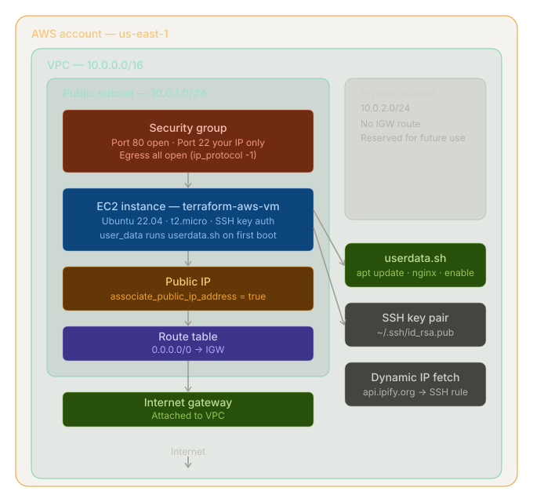

# Linux VM on AWS — Terraform Infrastructure Deployment

Production-style AWS infrastructure deployment for provisioning a Linux virtual machine using Terraform.

This project automates the creation of a secure AWS networking environment including a custom VPC, public and private subnets, security groups, routing configuration, and an Ubuntu EC2 instance bootstrapped with Nginx using `user_data`.

The goal of this project was to strengthen foundational cloud networking, infrastructure automation, and Linux server provisioning skills using Infrastructure as Code (IaC).

---



---

# Project Goal

The objective of this project was to simulate a real-world cloud infrastructure deployment workflow while applying secure networking and infrastructure provisioning practices.

This project focuses on:

- Infrastructure as Code (IaC)
- Cloud networking fundamentals
- Automated VM provisioning
- Secure SSH access configuration
- Linux server bootstrapping
- Terraform workflow fundamentals
- AWS VPC architecture concepts

---

# What This Builds

## Network Infrastructure

- Custom VPC (`10.0.0.0/16`)
- Public subnet (`10.0.1.0/24`)
- Private subnet (`10.0.2.0/24`)
- Internet Gateway attached to VPC
- Route table configured for internet outbound traffic
- Route table association for public subnet routing

## Security

- Security group with:
  - HTTP access open to the internet
  - SSH access restricted to deployer public IP only
- Explicit outbound egress rule for internet access
- Dynamic public IP detection for secure SSH access

## Compute

- Ubuntu 22.04 LTS EC2 instance (`t2.micro`)
- SSH key pair imported from local machine
- Public IP assignment enabled
- Automated Nginx installation through `user_data`

## Application Layer

- Nginx web server installed automatically
- Web service starts during first boot
- Server accessible through public browser request

---

# Architecture Flow

1. User accesses the EC2 public IP
2. Traffic routes through the Internet Gateway
3. Route table forwards external traffic to the public subnet
4. Security group allows HTTP traffic on port 80
5. Nginx responds with the default web server page

---

# Prerequisites

- [Terraform](https://developer.hashicorp.com/terraform/install)
- [AWS CLI](https://docs.aws.amazon.com/cli/latest/userguide/install-cliv2.html)
- Active AWS account
- SSH key pair located at:
  - `~/.ssh/id_rsa`
  - `~/.ssh/id_rsa.pub`

---

# Configure AWS CLI

```bash
aws configure
```

---

# Project Structure

```bash
linux-vm/
├── main.tf            # Infrastructure resources
├── userdata.sh        # VM bootstrap automation
├── .gitignore
├── README.md
├── WALKTHROUGH.md
└── docs/
    └── architecture.png
```

For a full deployment walkthrough and troubleshooting process see:

```bash
WALKTHROUGH.md
```

---

# Tech Stack

## Cloud Platform
- AWS

## Infrastructure as Code
- Terraform

## Compute
- EC2
- Ubuntu 22.04

## Networking
- VPC
- Subnets
- Route Tables
- Internet Gateway
- Security Groups

## Web Server
- Nginx

## Automation
- Bash
- user_data

---

# Infrastructure Features

- Fully automated provisioning workflow
- Dynamic SSH IP restriction
- Automated Linux server configuration
- Public and private subnet structure
- Secure SSH access configuration
- Reproducible infrastructure deployment
- Automated Nginx installation and startup

---

# Setup

## 1. Clone Repository

```bash
git clone https://github.com/0dow0ri7s3/tf-aws-infrastructure.git
cd tf-aws-infrastructure/linux-vm
```

---

## 2. Generate SSH Key (If Needed)

```bash
ssh-keygen -t rsa -b 4096
```

---

## 3. Initialize Terraform

```bash
terraform init
```

---

## 4. Plan Infrastructure

```bash
terraform plan -out=tfplan
```

---

## 5. Apply Infrastructure

```bash
terraform apply tfplan
```

After deployment completes, Terraform outputs the EC2 public IP address.

Paste the IP into a browser to verify that the Nginx web server is running successfully.

---

# Access the Server

```bash
http://<public_ip>
```

---

# SSH Into the VM

```bash
ssh -i ~/.ssh/id_rsa ubuntu@<public_ip>
```

AWS Ubuntu instances use:

```bash
ubuntu
```

as the default SSH username.

---

# Dynamic SSH IP Restriction

Terraform dynamically fetches the deployer's current public IP address:

```hcl
data "http" "my_ip" {
  url = "https://api.ipify.org"
}
```

If your IP changes:

```bash
terraform plan -out=tfplan
terraform apply tfplan
```

The security group updates automatically.

---

# userdata.sh

The bootstrap script executes automatically during first boot:

```bash
#!/bin/bash
apt-get update -y
apt-get install -y nginx
systemctl start nginx
systemctl enable nginx
```

---

# Security Considerations

- SSH access restricted to deployer's current public IP
- Explicit outbound egress configuration
- Public internet access limited to HTTP traffic
- Subnet separation implemented for networking structure
- Infrastructure configuration managed through Terraform

---

# Tear Down Infrastructure

```bash
terraform destroy
```

This removes all provisioned AWS resources.

---

# Key Lessons Learned

- AWS requires explicit egress rules for outbound internet access
- `user_data` scripts must include the correct shebang (`#!/bin/bash`) for cloud-init execution
- Dynamic IP retrieval simplifies secure SSH management
- `associate_public_ip_address = true` must be explicitly configured
- Route tables require explicit subnet association resources
- Terraform planning helps prevent accidental infrastructure changes
- Infrastructure automation improves deployment consistency and repeatability

---

# Challenges Faced

- Understanding AWS networking relationships between VPC, subnets, route tables, and Internet Gateways
- Configuring secure SSH access without exposing the VM publicly
- Troubleshooting cloud-init and userdata execution behavior
- Managing proper route table associations
- Learning Terraform resource dependency behavior

---

# Future Improvements

- Add Application Load Balancer
- Introduce Auto Scaling Group
- Add monitoring with CloudWatch
- Migrate setup into reusable Terraform modules
- Introduce Docker-based application deployment
- Store Terraform remote state in S3
- Add CI/CD automation using GitHub Actions

---

# Author

**Odoworitse Afari**  
Cloud & DevOps Engineer

GitHub: https://github.com/0dow0ri7s3  
LinkedIn: https://linkedin.com/in/odoworitse-afari
